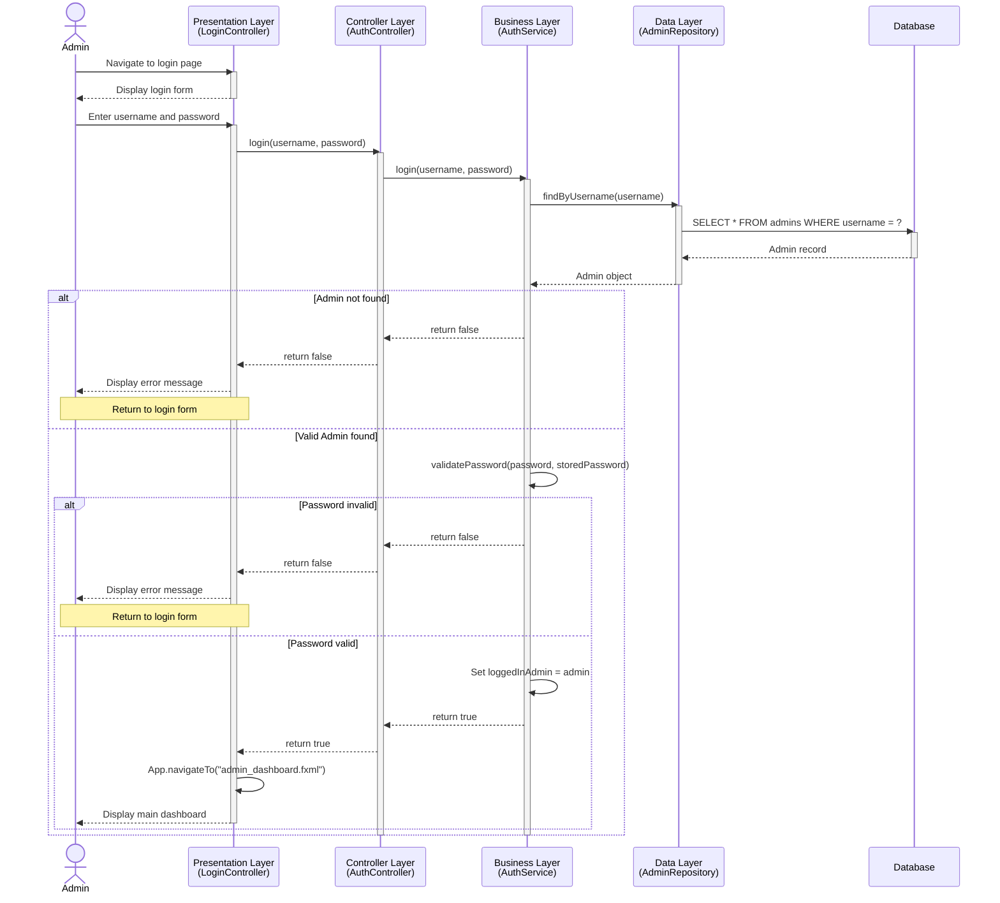

# SLIM - Login Sequence Diagram

This document presents the sequence diagram for the login process in the SLIM system, illustrating the interactions between the admin, presentation layer, business layer, and data layer.

## Related Use Cases

- **UC-1: Admin Login** - Primary use case

## Sequence Diagram

## Sequence Description

### Normal Flow

1. **Admin navigates to login page**
    - Admin requests access to the SLIM system
    - Presentation layer displays the login form

2. **Admin enters credentials**
    - Admin inputs username and password
    - Presentation layer sends credentials to AuthController, which delegates them to the AuthService

3. **User lookup**
    - AuthService requests AdminRepository to find the admin by username
    - AdminRepository queries the database for the admin record
    - Database returns admin data (if found)

4. **Credential validation**
    - AuthService validates the provided password against the stored password
    - If valid, the admin object is retained in memory as the currently active user

5. **Display results**
    - Successful authentication boolean is returned back through the controller to the UI
    - Presentation layer triggers navigation to the admin dashboard
    - Main dashboard is displayed

### Exception Flows

#### E1: Invalid Credentials

- Admin not found in the database or the password doesn't match
- Authentication process returns false
- Generic error message ("Invalid username or password.") is displayed to the admin
- Use case terminates, returning the user to the login form

## Key Components

### Presentation Layer

- **UI**: Handles user interface, form display, and triggers system navigation via LoginController
- **AuthController**: Intermediary controller routing the authentication requests

### Business Layer

- **AuthService**: Manages core authentication logic, credential validation, and maintains the `loggedInAdmin` state session

### Data Layer

- **AdminRepository**: Data access for admin entities
- **Database**: Persistent storage

## Business Rules Enforced

1. **Session State**: System access requires a successfully validated admin to be stored in the AuthService's `loggedInAdmin` state.
2. **Simplified Validation**: For local testing and simplified environments, plain password matching logic is utilized.

## Security Considerations

- Generic error messages are enforced on the UI layer to prevent username enumeration, ensuring attackers cannot distinguish whether the username or the password was the incorrect element.