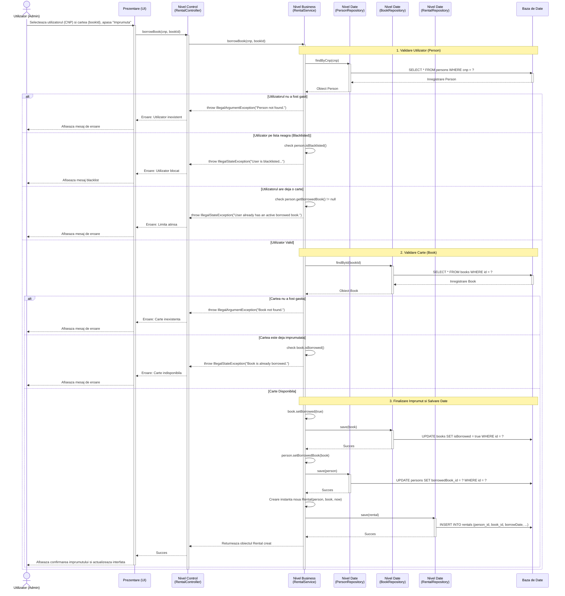

# SLIM - Diagrama de Secventa pentru Imprumut Carte (Borrow Book)

Acest document prezinta diagrama de secventa pentru procesul de imprumut al unei carti in sistemul SLIM, ilustrand interactiunile dintre administratorul bibliotecii, nivelul de prezentare, logica de business (servicii) si accesul la baza de date.

## Cazuri de Utilizare Asociate

- **UC-3: Imprumuta Carte** - Fluxul principal
- **UC-4: Verificare Stare Utilizator (Blacklist)** - Inclus in fluxul de imprumut

## Diagrama de Secventa

## Descrierea Secventei

### Fluxul Normal (Succes)

1. **Initierea imprumutului**
    - Administratorul selecteaza un utilizator pe baza CNP-ului, o carte pe baza ID-ului si apasa butonul de imprumut.
    - Nivelul UI apeleaza metoda `borrowBook` din `RentalController`.

2. **Validarea Utilizatorului**
    - `RentalService` obtine utilizatorul din baza de date prin `PersonRepository.findByCnp()`.
    - Se verifica daca utilizatorul exista.
    - Se verifica starea contului: nu trebuie sa fie pe lista neagra (`isBlacklisted() == false`).
    - Se verifica limita de imprumut: utilizatorul nu are voie sa aiba deja o carte imprumutata (`getBorrowedBook() == null`).

3. **Validarea Cartii**
    - `RentalService` obtine cartea din baza de date prin `BookRepository.findById()`.
    - Se verifica daca obiectul carte exista.
    - Se confirma disponibilitatea: cartea nu trebuie sa fie deja imprumutata (`isBorrowed() == false`).

4. **Actualizarea Starii si Persistenta**
    - Starea cartii se modifica in "imprumutata" (`book.setBorrowed(true)`) si este salvata prin `BookRepository`.
    - Utilizatorului i se asociaza cartea curenta (`person.setBorrowedBook(book)`) si modificarea este salvata prin `PersonRepository`.
    - Se instantiaza un nou obiect `Rental` care retine legatura dintre persoana, carte si data curenta (`LocalDate.now()`).
    - Noul imprumut este salvat definitiv in baza de date prin `RentalRepository`.

5. **Afisarea Rezultatului**
    - Obiectul creat se intoarce la UI, care informeaza administratorul de succesul operatiunii si actualizeaza datele pe ecran.

### Fluxuri de Exceptie (Erori)

#### E1: Utilizator Invalid sau Blocat
- Daca persoana nu e gasita, se arunca `IllegalArgumentException`.
- Daca e pe lista neagra, se arunca `IllegalStateException`.
- Operatiunea se intrerupe, iar UI-ul afiseaza eroarea.

#### E2: Limita de Carti Atinsa
- Daca utilizatorul are deja o carte, se arunca `IllegalStateException`. Operatiunea este respinsa automat.

#### E3: Carte Indisponibila
- Daca entitatea Book nu e gasita sau este deja marcata ca fiind imprumutata de altcineva, procesul este anulat printr-o exceptie, protejand consistenta bazei de date.

## Componente Cheie

### Nivelul Business (Business Layer)
- **RentalService**: Contine logica centrala, orchestrarea verificarilor si modificarea starilor pe trei entitati diferite (Person, Book, Rental).

### Nivelul de Date (Data Layer)
- **PersonRepository**: Gestioneaza citirea si scrierea detaliilor abonatilor.
- **BookRepository**: Gestioneaza inventarul bibliotecii si statusul cartilor.
- **RentalRepository**: Retine istoricul de tranzactii si imprumuturile active.

## Reguli de Business Enforced (Implementate)

1. **Restrictie la imprumut (Limita stricta)**: Un utilizator poate imprumuta **o singura carte simultan**.
2. **Preventia penalizarilor (Blacklist)**: Utilizatorii aflati sub incidenta penalizarii (delays depasite) nu pot face imprumuturi noi pana la expirarea perioadei.
3. **Consistenta Datelor**: Starea cartii si starea utilizatorului sunt sincronizate in acelasi context inainte de crearea fisei de imprumut (Rental).