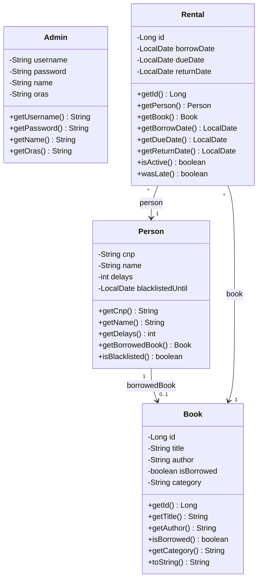

```mermaid
classDiagram
    class Admin {
        -String username
        -String password
        -String name
        -String oras
        +getUsername() String
        +getPassword() String
        +getName() String
        +getOras() String
    }

    class Book {
        -Long id
        -String title
        -String author
        -boolean isBorrowed
        -String category
        +getId() Long
        +getTitle() String
        +getAuthor() String
        +isBorrowed() boolean
        +getCategory() String
        +toString() String
    }

    class Person {
        -String cnp
        -String name
        -int delays
        -LocalDate blacklistedUntil
        +getCnp() String
        +getName() String
        +getDelays() int
        +getBorrowedBook() Book
        +isBlacklisted() boolean
    }

    class Rental {
        -Long id
        -LocalDate borrowDate
        -LocalDate dueDate
        -LocalDate returnDate
        +getId() Long
        +getPerson() Person
        +getBook() Book
        +getBorrowDate() LocalDate
        +getDueDate() LocalDate
        +getReturnDate() LocalDate
        +isActive() boolean
        +wasLate() boolean
    }

    Person "1" --> "0..1" Book : borrowedBook
    Rental "*" --> "1" Person : person
    Rental "*" --> "1" Book : book
```